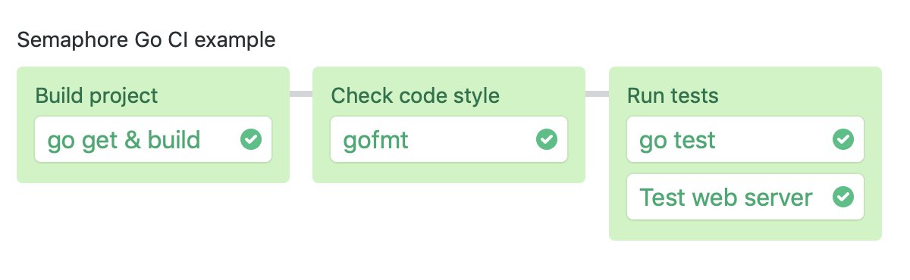

> **This is my personal practice for the GO language.**

> Requests dir: HTTP standard library, how to process REST API requests and responses

> Semaphore_demo dir: Is coppied from https://github.com/kunchalavikram1427/go-cicd and is used for learning and modifying
# Semaphore demo CI pipeline using Go

This is an example program and CI pipeline showing how to run a Go project on
Semaphore 2.0.

## CI on Semaphore

Feel free to fork this repository and use it.

The CI pipeline is defined in `.semaphore/semaphore.yml` and when you run it it
will look like this:

You can extend the pipeline with deployment by implementing a
[promotion][promotions].  Refer to Semaphore documentation for additional
[deployment examples][deployment-examples].